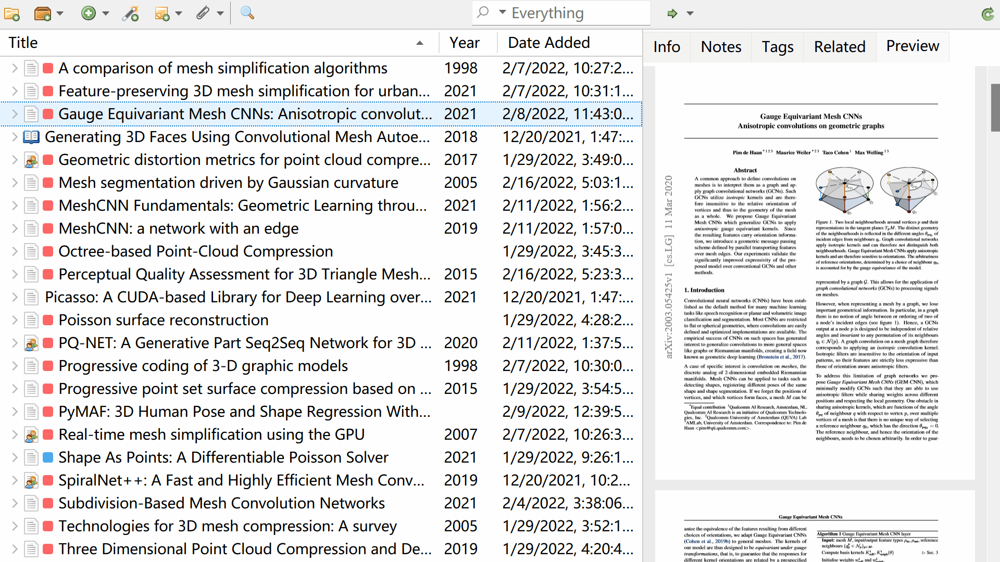

# Preview for Zotero

[](https://www.zotero.org)
[](https://github.com/windingwind/zotero-plugin-template)



Preview attachments in the library view.

Fast & easy. Do not require any third-party softwares.

## 🧩 Outline

[👋 Install](#-install)

[😎 Quick start](#-quick-start)

[🔧 Development](#-development)

[🔎 My Zotero Plugins](#-my-zotero-plugins)

[💰 Sponsor Me](#-sponsor-me)

## 👋 Install

> For Zotero 6, install the [latest stable version](https://github.com/windingwind/zotero-pdf-preview/releases/latest); For Zotero 7, install the [latest prerelease version](https://github.com/windingwind/zotero-pdf-preview/releases/)

- Download the latest release (.xpi file) from the [Releases Page](https://github.com/windingwind/zotero-pdf-preview/releases)
  _Note_ If you're using Firefox as your browser, right-click the `.xpi` and select "Save As.."
- In Zotero click `Tools` in the top menu bar and then click `Addons`
- Go to the Extensions page and then click the gear icon in the top right.
- Select `Install Add-on from file`.
- Browse to where you downloaded the `.xpi` file and select it.
- Finish!

## 😎 Quick start

Preview can be found in the right side panel of Zotero's main window. You can preview items in either the top/bottom of the info pane or the preview pane. See [Settings](#settings) to customize your preview position.

### Shortcuts

To show/hide the preview in info pane, use shortcut `P` or drag/click the toggel bar.

To zoom in or zoom out, hold `ctrl/cmd` and scroll, or `ctrl/cmd and +/-`;

To reset zoom, use `ctrl/cmd + 0`.

### Settings

Find settings here: Menubar -> Edit -> Preferences -> Preview

| Setting                                    | Details                                                                                                              | Default Value |
| ------------------------------------------ | -------------------------------------------------------------------------------------------------------------------- | ------------- |
| Enable Preview                             | Enable to allow the preview behavior.                                                                                | `true`        |
| Preview in Info Tab                        | Enable to show the preview in a split view under 'info' tab.                                                         | `true`        |
| Preview Position                           | Preview position in the Info Tab                                                                                     | `bottom`      |
| Preview in 'Preview' Tab                   | Enable show the preview in a new tab of right sidebar.                                                               | `true`        |
| Show Toolbar in Info Tab/Preview Tab       | Enable show the toolbar there.                                                                                       | `true`        |
| Show Annotations                           | Enable to show annotations of the PDF files. May slow down the preview speed.                                        | `false`       |
| Show Hovered Page Style                    | Enable extra style of the hovered page: box shadow and hand cursor.                                                  | `true`        |
| Double-click Preview Page to Open/Jump PDF | Enable double-click to open/jump to the selected page of PDF.                                                        | `true`        |
| Dark Mode                                  | Enable to preview PDF files in dark mode. This is a naive dark mode and images color may not be displayed correctly. | `false`       |
| Preview First _N_ Pages                    | See [below](#advanced-usage-of-preview-page-index)                                                                   | `10`          |
| Preview Tab Name                           | Set the tab label.                                                                                                   | `preview`     |

### Advanced Usage of Preview Page Index

A python-style slice command is supported.

<details>
  <summary>Syntax: Click to expand</summary>
  
  `command1,command2,...`  
Supported Commands:

- Number  
  Number from 1 to last page

  > Example:  
  > `1`  
  > preview page 1

  ***

  > Example:  
  > `10`  
  > preview page 10

- Slice  
   `startIndex:stopIndex`.  
   The `startIndex` page is included while the `stopIndex` page is excluded.

  `startIndex` or `stopIndex` may be a negative number, which means it counts from the end of the file instead of the beginning.

  The `startIndex` or `stopIndex` may be missing to indicate that starts from the first page or ends at the last page.

  > Example:  
  > `1:11`  
  > preview page 1-10

  ***

  > Example:  
  > `:11`  
  > preview page first page(1)-10

  ***

  > Example:  
  > `10:`  
  > preview page 10-last page

  ***

  > Example:  
  > `-3:`  
  > preview last 3 pages

  ***

  > Example:  
  > `:-3`  
  > preview page first page(1)-last 3rd page(excluded)

  ***

  > Example:  
  > `:`  
  > preview every page

  </details>

## 🔧 Development

This plugin is built based on the [Zotero Plugin Template](https://github.com/windingwind/zotero-plugin-template). See the setup and debug details there.

To startup, run

```bash
git clone https://github.com/windingwind/zotero-better-notes.git
cd zotero-better-notes
npm install
npm run build
```

The plugin is built to `./builds/*.xpi`.

## 🔔 Disclaimer

Use this code under AGPL. No warranties are provided. Keep the laws of your locality in mind!

## 🔎 My Zotero Plugins

- [zotero-pdf-translate](https://github.com/windingwind/zotero-pdf-translate): PDF translation for Zotero
- [zotero-pdf-preview](https://github.com/windingwind/zotero-tag): PDF preview for Zotero
- [zotero-tag](https://github.com/windingwind/zotero-tag): Automatically tag items/Batch tagging

## 💰 Sponsor Me

I'm windingwind, an active Zotero(https://www.zotero.org) plugin developer. Devoting to making reading papers easier.

Sponsor me to buy a cup of coffee. I spend more than 24 hours every week coding, debugging, and replying to issues in my plugin repositories. The plugins are open-source and totally free.

If you sponsor more than $10 a month, you can list your name/logo here and have priority for feature requests/bug fixes!
